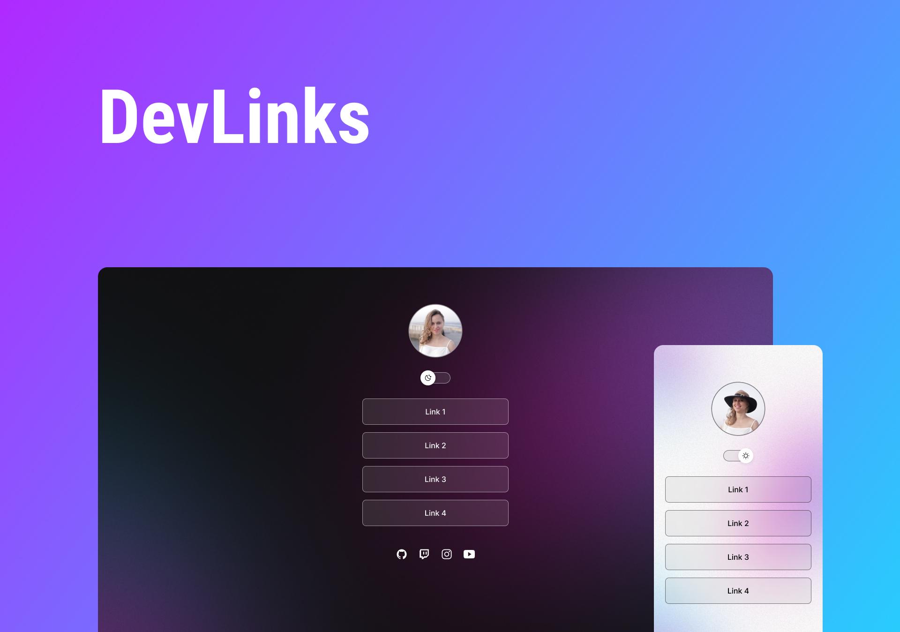

<h1 align="center"> Devlinks </h1>

Cartão de visitas de Elide Paixão  

  <a href="#-tecnologias">Tecnologias</a>&nbsp;&nbsp;&nbsp;|&nbsp;&nbsp;&nbsp;
  <a href="#-projeto">Projeto</a>&nbsp;&nbsp;&nbsp;|&nbsp;&nbsp;&nbsp;
  <a href="#-layout">Layout</a>&nbsp;&nbsp;&nbsp;|&nbsp;&nbsp;&nbsp;
  <a href="#memo-licença">Licença</a>

  

 

  

## 🚀 Tecnologias

Esse projeto foi desenvolvido com as seguintes tecnologias:

- HTML e CSS
- JavaScript
- Git e Github
- Figma

## 💻 Projeto

Um cartão de visitas on line contendo os links para o meu GitHub e Linkedin.

## Layout

Você pode visualizar o projeto através desse link:
https://www.figma.com/file/acFQfiJtMPdmNiMONKKQS4/DevLinks-(Community)?t=rMHNDbM6U1Jp6SAn-0

- [Visite o projeto online] (https://elidepaixao.github.io/cartao-de-visitas)